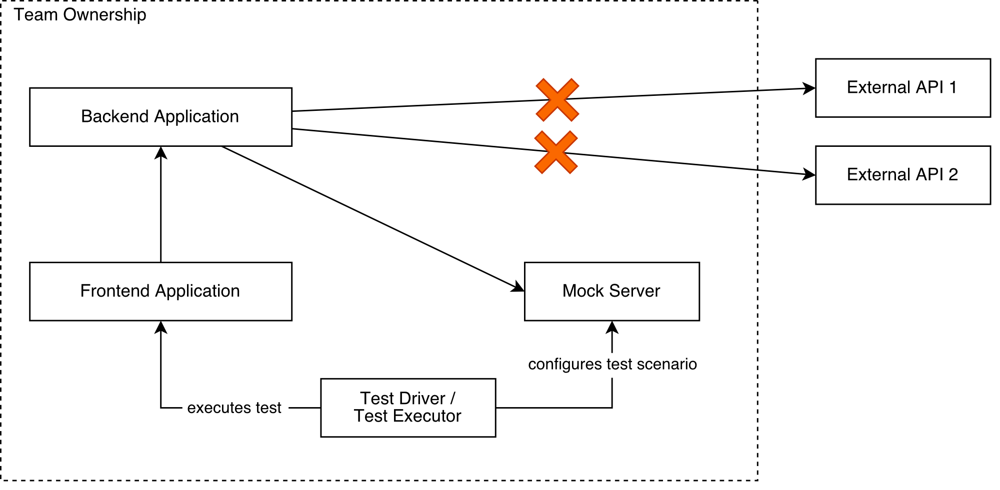

+++
author = "Alexander Liesenfeld"
title = "Rust HTTP Testing with httpmock"
date = "2020-03-05"
description = "Rust HTTP Testing with httpmock"
tags = [
    "rust",
    "http",
    "mock",
    "test"
]
+++

At some point, most developers needed to test applications that interact with external HTTP services, such as third-party APIs, authentication providers, or data sources. These services are not always available to us, especially during automated tests or when prototyping a new service. To verify that our applications use these APIs as expected, we need tools that allow us to verify outgoing requests and to mimic API responses tailored to our use cases and test scenarios. This is where mocking libraries can help.

HTTP mocking libraries usually allow you to create an HTTP server and to configure it for custom request/response scenarios. While most libraries provide functionality to mock HTTP servers in automated tests, some also give you the possibility to run a configurable standalone server application that mimics APIs for multiple applications at once. This article shows how we can use such tools to mock third-party APIs in Rust.

## The App
Let's suppose we are building a Rust app that will create a GitHub repository on our behalf. To perform these operations we will use the GitHub REST API. We will then write some automated tests to verify correct behaviour by simulating HTTP responses from GitHub.

### Let's start!
Let's first create a new cargo package for our app and name it `github_api_client`:
```sh
cargo new github_api_client --bin
```

We'll also need some libraries, so let's add them to our dependency list. We'll use 
- `isahc` as our HTTP client library,
- `serde_json` for easy JSON serialization and deserialization, and 
- `custom_error` to create custom error types.

`Cargo.toml`:
```toml
[dependencies]
isahc = { version = "1.6", features = ["json"]}
serde_json = "1.0"
anyhow = "1.0"
```

### The Client

Now let's add the following code that will allow us to access the GitHub REST API. We will create a structure named `GithubClient` that will contain all the logic required to access the GitHub API.

`main.rs`:
```rust
use isahc::{ReadResponseExt, Request, RequestExt};
use serde_json::{json, Value};
use anyhow::{Result,ensure};

pub struct GithubClient {
    base_url: String,
    token: String,
}

impl GithubClient {
    pub fn new(token: &str, base_url: &str) -> GithubClient {
        GithubClient { base_url: base_url.into(), token: token.into() }
    }

    pub fn create_repo(&self, name: &str) -> Result<String> {
        let mut response = Request::post(format!("{}/user/repos", self.base_url))
            .header("Authorization", format!("token {}", self.token))
            .header("Content-Type", "application/json")
            .body(json!({ "name": name, "private": true }).to_string())?
            .send()?;

        let json_body: Value = response.json()?;

        ensure!(response.status().as_u16() == 201, "Unexpected status code");
        ensure!(json_body["html_url"].is_string(), "Missing html_url in response");

        return Ok(json_body["html_url"].as_str().unwrap().into());
    }
}

fn main() {
    let github = GithubClient::new("<github-token>", "https://api.github.com");
    let url = github.create_repo("myRepo").expect("Cannot create repo");
    println!("Repo URL: {}", url);
}
```

The only method our client provides for now is `create_repo`. It takes the repository name as an argument and returns a `Result` containing the repository URL as a string value. To keep this example simple, we use the `anyhow` crate for generic error handling.

### The Problem

Now that we have a functional app, we want to write some tests to make sure it doesn't have any obvious problems.

One tricky part is to find a suitable target for mocking so that we can test the behaviour of our client in different situations. In our case, the HTTP clients `Request::post` function looks like a good place to start, because it's the last function that our GitHub client calls before it sends a request to the GitHub API servers.

Unfortunately, mocking HTTP clients is not very practical if there is no dedicated mocking library for your particular HTTP client. This is because in a larger application, we would need to reimplement a big chunk of the HTTP clients API to be able to adequately simulate request/response scenarios. So what to do?

### The Solution

To test our GitHub API client conveniently, we can use an HTTP mocking library. Such libraries can help us with at least two testing targets:

- Verifying that all HTTP requests our client sends are correct (i.e., contain all expected values). 
- Simulating HTTP responses from the GitHub API to see if our client can deal with them accordingly.

At the time of writing there are 4 noteworthy Rust libraries that can help us with this:

- `mockito`
- `httpmock`
- `httptest`
- `wiremock`.

The following comparison matrix shows how the libraries compare to each other:

| Library     | Execution  | Custom Matchers | Mock- able APIs | Sync API | Async API | Stand-alone Mode 
| ----------- | ---------- | ------- | ---------------- | --------------- | --------------- | -------- |
| mockito     | serial     | no              | 1             | yes      | no        | no              
| **httpmock**    | **parallel**   | **yes**             | **∞**    | **yes**      | **yes**       | **yes**             
| httptest    | parallel   | yes             | ∞     | yes      | no        | no              
| wiremock | parallel   | yes             | ∞     | no       | yes       | no              

According to the comparison matrix, the most complete package is currently provided by `httpmock`. For this reason, we will use this one for the rest of this article (and because the author is the creator of `httpmock` 😛). Although we will use `httpmock`, you can also find most of the presented features in any of the other libraries as well.

## Creating Mocks

In this section, we'll write some tests to verify that our GitHub API client works as expected. Let’s first add the `httpmock` crate to our dependencies:

`Cargo.toml`:
```rust
[dev-dependencies]
httpmock = "0.6"
```

Now we’re all set. Let’s create a test that will make sure the "good path" in our client implementation works as expected:

`main.rs`:
```rust
// ...
1  #[cfg(test)]
2  mod tests {
3      use crate::GithubClient;
4      use httpmock::MockServer;
5      use serde_json::json;
6  
7      #[test]
8      fn create_repo_success_test() {
9          // Arrange
10         let server = MockServer::start();
11         let mock = server.mock(|when, then| {
12             when.method("POST")
13                 .path("/user/repos")
14                 .header("Authorization", "token TOKEN")
15                 .header("Content-Type", "application/json");
16             then.status(201)
17                 .json_body(json!({ "html_url": "http://example.com" }));
18         });
19         let client = GithubClient::new("TOKEN", &server.base_url());
20 
21         // Act
22         let result = client.create_repo("myRepo");
23 
24         // Assert
25         mock.assert();
26         assert_eq!(result.is_ok(), true);
27         assert_eq!(result.unwrap(), "http://example.com");
28     }
39 }
```

We arranged the test code following the [AAA (Arrange-Act-Assert) pattern](https://medium.com/@pjbgf/title-testing-code-ocd-and-the-aaa-pattern-df453975ab80), which divides the test into three parts: Arrange, Act, and Assert.

### Arrange

The first thing we do in our test is to create a `MockServer` instance (line `10`) which we then use to create a `Mock` object with 

1. all values that the `MockServer` should expect from an incoming HTTP request (lines `12`–`15`), and 
2. a specification for HTTP responses that will be sent back should any incoming HTTP request match all expected values (lines `16`–`17`).   

Notice how we used the `when` variable to define request expectations and the `then` variable to specify response values. 

The mock server will only respond if it receives an HTTP request that meets all expectations. Otherwise, it will respond with an error message and HTTP status code `404`.

*Important*: Observe how we set the base URL in our client to point to the mock server instead of the real GitHub API (line `19`).

### Act

In this part we execute our code under test (line `22`) which is the method `create_repo` of our `GithubClient`.

### Assert

At last, we use the `assert` method provided by the `Mock` object (line `25`). This method makes sure that the mock server received exactly one HTTP request that matched all expectations. If not, it will fail the test and print a detailed problem description (see next section).

## Debugging

`Mock` objects provide an `assert` method which ensures that our application sent a request to the mock server that matched all expectations (the `when`). If not, this method will fail the test. In this case, `httpmock` will try to find a request in its request journal that is most similar to your mock expectations. It will then identify the differences between the two, so you can easily spot incorrect or missing values. 

To demonstrate this feature, we will modify our client to send `text/plain` in the `content-type` header instead of `application/json`. If we then rerun the test, we'll see that this change is detected, and the test fails now with the following message:

```console
At least one request has been received, but none exactly matched the mock specification.
Here is a comparison with the most similar request (request number 1): 
1 : Expected header with name 'Content-Type' and value 'application/json' to be present in the request but it wasn't.
------------------------------------------------------------------------------------------
Expected:                [key=equals, value=equals]   Content-Type=application/json
Actual (closest match):                               content-type=text/plain
```

Depending on the IDE you're using, you will also be able to see the differences between the expected and the actual value in a differences viewer. For example, this is how it would look like in IntelliJ or CLion:


## Standalone Mock Servers

Until now we only looked at how we can mock external HTTP services in automated integration tests. Some end-to-end tests, however, may involve multiple applications which need access to HTTP services. These may not be easily available for tests (e.g., because they are not in your ownership). 

Especially in early development stages or during prototyping, chances are that some services are still under development and not yet ready for usage. In this case, it may be practical to have a dedicated mock server running in a separate process that provides mocked APIs for multiple applications. One benefit of this approach is that a test driver application could configure the mock server to respond to requests depending on the current test scenario. 



Some mocking libraries come with an optional standalone mock server, for some others there are third-party exentions. For example, `httpmock` comes with a separate [Docker image](https://hub.docker.com/r/alexliesenfeld/httpmock) that lets you run a dedicated mock server that can be used in the following ways: 

* *Rust Test Driver*: The test executor is a Rust test that uses `httpmock` the same way as presented in our examples above, with the only difference that it connects to a remote mock server (e.g., by using [`MockServer::connect("localhost:5000")`](https://docs.rs/httpmock/0.6.4/httpmock/struct.MockServer.html#method.connect)) rather than creating a local mock server instance (e.g., using [`MockServer::start()`](https://docs.rs/httpmock/0.6.4/httpmock/struct.MockServer.html#method.start)).
* *Static YAML File Configuration*: Allows you to configure the mock server by reading from a directory of YAML mock definition files (similar to Rust API, see example [here](https://github.com/alexliesenfeld/httpmock/blob/master/tests/resources/static_yaml_mock.yaml)).

## Conclusion

This article showed how `httpmock` can be used to test HTTP-based API clients in Rust. It allowed us to verify that our application was sending HTTP requests that matched our expectations. We could simulate HTTP responses from the GitHub API using `httpmock` to make sure that our app can process them as accordingly.


You can find the source code from this article [on Github](https://github.com/alexliesenfeld/blog-rust-http-testing-with-httpmock).
